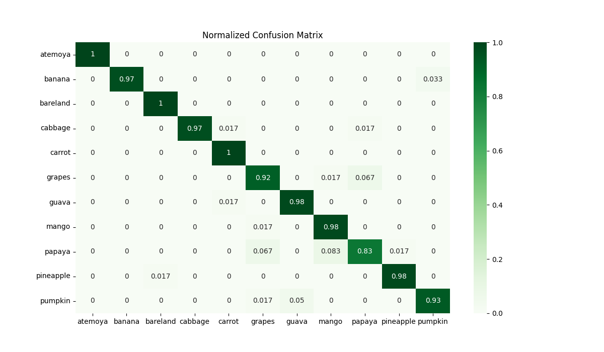

# Crop Identification

  
 Introduction

This project focuses on developing a machine learning-based **task recognition system** to classify various **crop types from images**. The primary objective is to accurately identify different crops using a given dataset, which includes ten distinct crop types and bare land. Each class in the dataset consists of **300 images** with a resolution of **224x224 pixels**, ensuring balanced data for training and evaluation.

The project employs a robust training and evaluation pipeline using **PyTorch**, integrating data augmentation techniques and regularization to enhance the model's performance. The ultimate goal is to achieve a high accuracy in crop recognition, which has significant implications for **agricultural analysis** and **precision farming**.

  
 Data Description

The dataset used in this project contains images of the following ten crop types along with a class for bare land:

- **Guava**
  
- **Atemoya**
  
- **Carrot**
  
- **Cabbage**
  
- **Banana**
  
- **Grape**
  
- **Pineapple**
  
- **Mango**
  
- **Papaya**
  
- **Pumpkin**
  
- **Bare land**
  

Each class comprises **300 images**, and all images are uniformly sized at **224x224 pixels**. This standardization ensures consistency in the model training and evaluation processes.

  
 Model Selection

### Algorithm Selection
The primary algorithm used in this project is the **Convolutional Neural Network (CNN)**. CNNs are a type of deep learning algorithm that are particularly well-suited for image classification tasks due to their ability to automatically and adaptively learn spatial hierarchies of features from input images. We chose CNNs because of their proven effectiveness in recognizing patterns, textures, and shapes in image data, which is essential for accurately classifying different crop types from their visual representations.

### Hyperparameter Tuning
For hyperparameter tuning, we focused on optimizing several key parameters to improve model performance:
- **Learning Rate**: We experimented with different learning rates, starting from an initial value **0.0001** and adjusting it dynamically based on the model's convergence.
- **Batch Size**: A batch size of **16** was selected to balance training speed and memory efficiency.
- **Optimizer**: We used the **Stochastic Gradient Descent (SGD)** optimizer with a momentum of 0.9. The momentum helps in accelerating gradients vectors that are in the right directions, thus leading to faster converging.
- **Data Augmentation**: Techniques like **horizontal and vertical flipping**, as well as **color jittering**, were used to artificially increase the diversity of the training dataset.

  
 Experimental Design

### Training/Test Split
- **Training Set**: 80% of the data was used for training the model. This subset was used to learn the features and patterns associated with each crop type.
- **Test Set**: The remaining 20% of the data was reserved as the test set, which provides an unbiased evaluation of the model's performance on unseen data.

### Model Training
The model training process involved the following steps:
1. **Data Preprocessing**: The input images were resized to 224x224 pixels and underwent data augmentation to improve the model's robustness against overfitting.
2. **Batch Processing**: A batch size of 16 was used to process the data in smaller chunks, making the training process more memory efficient.
3. **Learning Rate and Optimizer**: We used an initial learning rate defined in the configuration file and the SGD optimizer with momentum to ensure faster convergence and stable updates.

### Evaluation Metrics
To comprehensively evaluate the model's performance, we used the following metrics:
- **Accuracy**: Measures the overall percentage of correctly classified samples in the dataset.
- **Precision**: Evaluates the accuracy of positive predictions, i.e., how many of the predicted positive instances were actually positive.
- **Recall**: Measures the ability of the model to identify all relevant instances, i.e., how many actual positives were correctly identified by the model.
- **F1 Score**: The harmonic mean of precision and recall, which provides a balanced measure that considers both false positives and false negatives.

  
 Result

### Performance
- **Accuracy**: **96.04%**
- **Precision**: **0.9607**
- **Recall**: **0.9605**
- **F1 Score**: **0.9602**

### Confusion Matrix

  
 Discussion

### Misclassification
- **The data classification was originally wrong.**
  
- **There are many kinds of plants in the picture.**
  
  
  
- **Something blocks it.**
   
   

